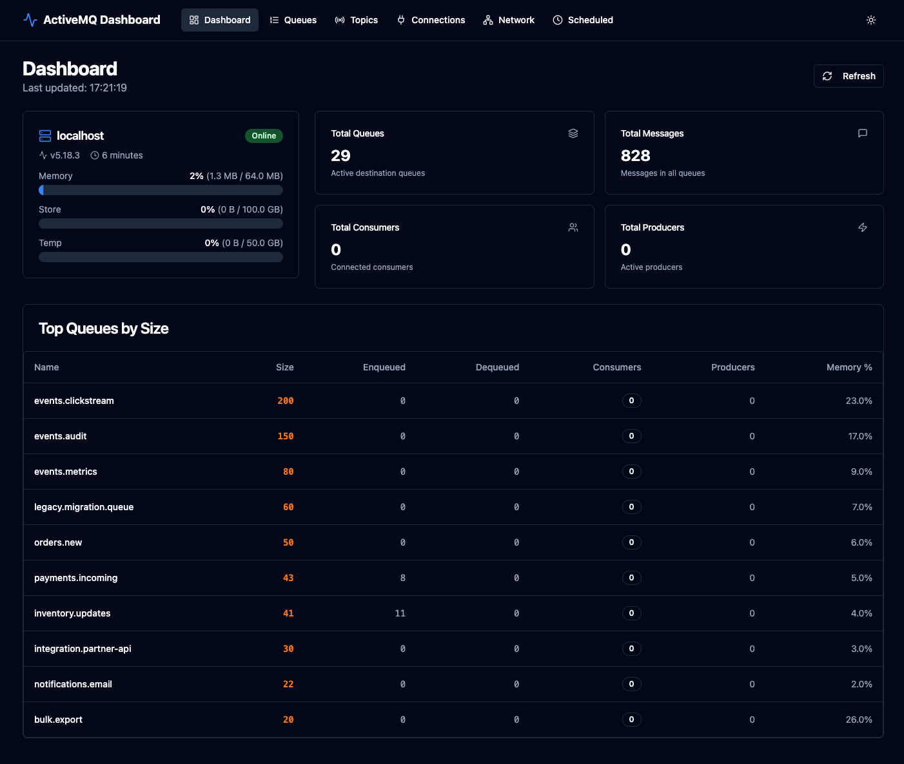
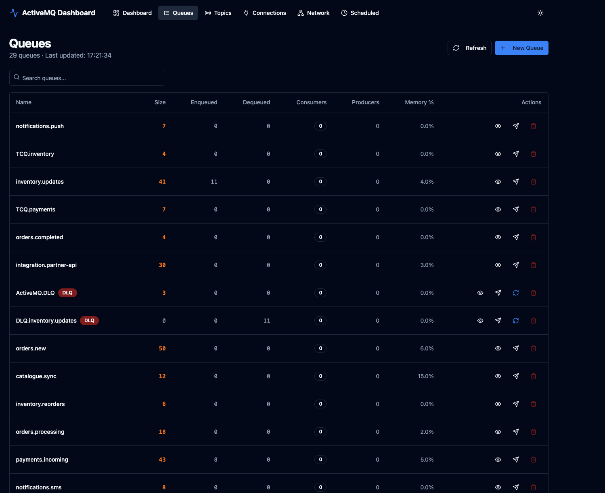
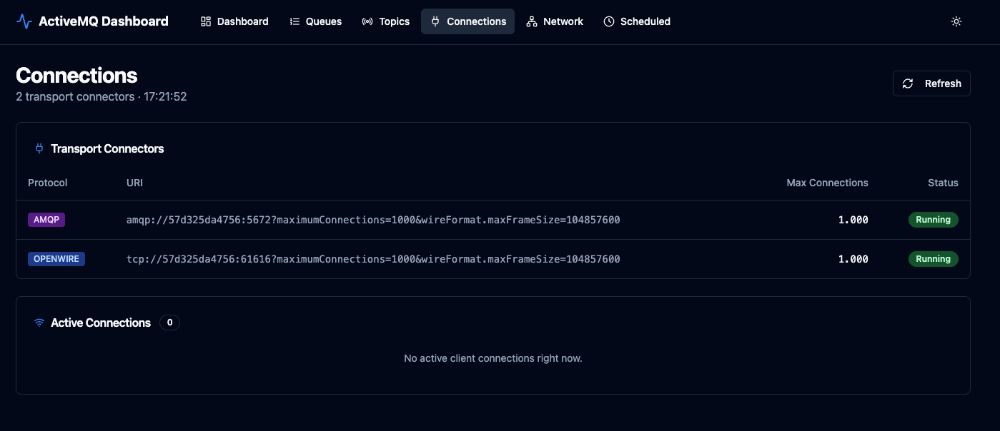
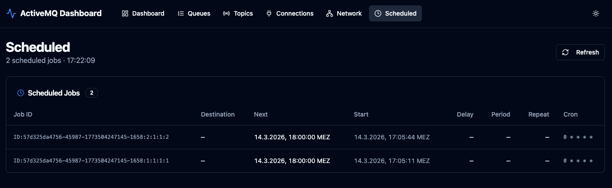

# ActiveMQ Dashboard

A modern, open-source management UI for **Apache ActiveMQ Classic** — built to replace the outdated default web console with a fast, readable, and operator-friendly interface.



---

## Why this instead of the default console?

| | Default Console | This Dashboard |
|---|---|---|
| **Design** | Java-era table UI | Clean dark/light mode, shadcn/ui |
| **Auto-refresh** | Manual page reload | Live refresh every 10 seconds |
| **DLQ handling** | No visual distinction | DLQ badge, per-message retry button |
| **Message browser** | Basic text dump | Structured viewer with properties |
| **Send messages** | Simple form | Full JMS headers, scheduling, persistence |
| **Scheduled jobs** | Raw JMX output | Human-readable table with local timezone |
| **Connections** | Mixed view | Split transport connectors / active connections |
| **Network connectors** | Buried in XML | Dedicated tab with status |
| **Queue search** | None | Instant client-side filter |
| **API** | No REST API | Clean JSON REST API (`/api/v1/...`) |
| **Deployment** | Bundled with broker | Independent Docker service |

---

## Screenshots

### Dashboard
Real-time broker health — memory, store, temp usage, top queues by size.


### Queues
Full queue list with search, DLQ/TCQ badges, message browser, send, move, purge, and per-message retry.



### Connections
Transport connector status (AMQP, OpenWire, STOMP, MQTT) and live active client connections.



### Scheduled Messages
All pending scheduled jobs with next execution time and cron expression, in your local timezone.



---

## Features

- **Dashboard** — broker version, uptime, memory/store/temp gauges, top queues by size
- **Queues** — list, search, create, purge; DLQ and TCQ visual badges
- **Message browser** — browse queue contents, view full message body + JMS properties
- **Send messages** — body, custom properties, full JMS headers (correlation ID, reply-to, priority, TTL, delivery mode), scheduling (delay, period, repeat, cron)
- **Move messages** — move any message to another queue
- **DLQ retry** — per-message retry button to requeue directly from a dead-letter queue
- **Topics** — list, search, create; enqueue/dequeue/consumer/producer stats
- **Connections** — transport connectors with protocol badges, active client connections
- **Network** — network connector list with duplex/bridge flags
- **Scheduled** — pending scheduled jobs (next, start, delay, period, repeat, cron) in local timezone
- **Dark / light mode** — persisted to `localStorage`
- **10-second auto-refresh** on all pages

---

## Installation

### Option A: Docker Compose

The fastest way to get started — includes a bundled ActiveMQ broker.

**Prerequisite:** [Docker](https://docs.docker.com/get-docker/) and Docker Compose

```bash
git clone https://github.com/qrowned/modern-activemq-dashboard.git
cd modern-activemq-dashboard
docker compose up -d
```

Open **http://localhost:3000**. Default ActiveMQ credentials: `admin` / `admin`.

| Service | Port | Description |
|---|---|---|
| ActiveMQ | `8161` | Web console + Jolokia API |
| ActiveMQ | `61616` | OpenWire (TCP) |
| ActiveMQ | `61613` | STOMP |
| Backend | `8080` | REST API |
| Frontend | `3000` | Dashboard UI |

#### Connecting to an existing broker

If you already have ActiveMQ running, create a `docker-compose.override.yml` next to `docker-compose.yml`:

```yaml
services:
  activemq:
    profiles: ["disabled"]   # skip the bundled broker

  backend:
    environment:
      ACTIVEMQ_URL: http://your-broker-host:8161
      ACTIVEMQ_USER: admin
      ACTIVEMQ_PASSWORD: your-password
      BROKER_NAME: your-broker-name   # brokerName from activemq.xml
```

Then start only the dashboard:

```bash
docker compose up -d backend frontend
```

---

### Option B: Kubernetes (Helm)

**Prerequisites:** kubectl, Helm 3.10+, an existing ActiveMQ broker reachable from the cluster.

```bash
helm repo add activemq-dashboard https://qrowned.github.io/modern-activemq-dashboard
helm repo update

helm install my-amq activemq-dashboard/activemq-dashboard \
  --namespace activemq-dashboard --create-namespace \
  --set activemq.url=http://your-broker:8161 \
  --set activemq.user=admin \
  --set activemq.password=your-password \
  --set activemq.brokerName=your-broker-name
```

Access the dashboard:

```bash
kubectl port-forward svc/my-amq-activemq-dashboard-frontend 3000:80 -n activemq-dashboard
```

Open **http://localhost:3000**.

#### Enable ingress

```bash
helm upgrade my-amq activemq-dashboard/activemq-dashboard --reuse-values \
  --set ingress.enabled=true \
  --set ingress.host=activemq-dashboard.example.com
```

With TLS via cert-manager:

```bash
helm upgrade my-amq activemq-dashboard/activemq-dashboard --reuse-values \
  --set ingress.enabled=true \
  --set ingress.host=activemq-dashboard.example.com \
  --set ingress.annotations."cert-manager\.io/cluster-issuer"=letsencrypt-prod \
  --set ingress.tls[0].hosts[0]=activemq-dashboard.example.com \
  --set ingress.tls[0].secretName=activemq-dashboard-tls
```

#### Use an existing Secret

Compatible with External Secrets Operator, Vault, and Sealed Secrets. The Secret must have keys: `ACTIVEMQ_URL`, `ACTIVEMQ_USER`, `ACTIVEMQ_PASSWORD`, `BROKER_NAME`.

```bash
helm install my-amq activemq-dashboard/activemq-dashboard \
  --namespace activemq-dashboard --create-namespace \
  --set existingSecret=my-secret-name
```

#### Upgrade

```bash
helm repo update
helm upgrade my-amq activemq-dashboard/activemq-dashboard --reuse-values
```

#### Helm values reference

| Key | Default | Description |
|---|---|---|
| `activemq.url` | `http://activemq:8161` | ActiveMQ broker URL |
| `activemq.user` | `admin` | Broker username |
| `activemq.password` | `admin` | Broker password |
| `activemq.brokerName` | `localhost` | `brokerName` from activemq.xml |
| `existingSecret` | `""` | Name of a pre-created Secret (skips chart Secret) |
| `backend.image.tag` | `latest` | Backend image tag |
| `backend.replicaCount` | `1` | Backend replicas |
| `frontend.image.tag` | `latest` | Frontend image tag |
| `frontend.replicaCount` | `1` | Frontend replicas |
| `ingress.enabled` | `false` | Create an Ingress resource |
| `ingress.className` | `nginx` | Ingress class |
| `ingress.host` | `activemq-dashboard.example.com` | Hostname |
| `ingress.annotations` | `{}` | Ingress annotations |
| `ingress.tls` | `[]` | TLS configuration |

---

## Configuration Reference

### Backend environment variables

| Variable | Default | Description |
|---|---|---|
| `ACTIVEMQ_URL` | `http://localhost:8161` | ActiveMQ broker base URL (must expose Jolokia) |
| `ACTIVEMQ_USER` | `admin` | Jolokia / REST API username |
| `ACTIVEMQ_PASSWORD` | `admin` | Jolokia / REST API password |
| `BROKER_NAME` | `localhost` | Value of `brokerName` in your `activemq.xml` |
| `PORT` | `8080` | Port the backend listens on |

---

## REST API

The backend exposes a clean JSON API you can use directly from scripts or other tools.

```
GET  /api/v1/health
GET  /api/v1/brokers

GET  /api/v1/queues
POST /api/v1/queues                           { "name": "my.queue" }
GET  /api/v1/queues/{name}/messages
POST /api/v1/queues/{name}/send
POST /api/v1/queues/{name}/move
POST /api/v1/queues/{name}/retry
POST /api/v1/queues/{name}/purge

GET  /api/v1/topics
POST /api/v1/topics                           { "name": "my.topic" }

GET  /api/v1/connections
GET  /api/v1/connections/active

GET  /api/v1/network

GET  /api/v1/scheduled
```

See [`API_SPEC.md`](API_SPEC.md) for full request/response schemas.

---

## Enabling Scheduled Messages

The Scheduled tab requires the ActiveMQ job scheduler plugin. Add `schedulerSupport="true"` to your broker element in `activemq.xml`:

```xml
<broker schedulerSupport="true" brokerName="localhost" ...>
  ...
</broker>
```

The dashboard detects whether the scheduler is enabled and shows an instruction card if it is not.

---

## Requirements

- Apache ActiveMQ Classic **5.x** (tested on 5.18.3)
- Jolokia endpoint enabled (default on all ActiveMQ 5.x installations)
- Docker 20+ for Docker Compose, or kubectl + Helm 3.10+ for Kubernetes

---

## License

MIT
